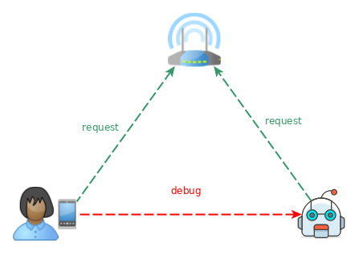
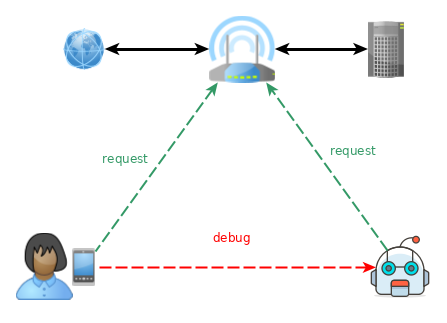

# PyROS

The product of my [ROS @fa[external-link]](ros.org) experience

---

@snap[north span-100]

## Confused ?

Two Different perspectives:

@snapend

@snap[west span-50]
@ul[spaced]
- rospy wants to put python inside ROS
- a.k.a 'Python as an afterthought'
@ulend
@snapend

@snap[east span-50]
@ul[spaced]
- PyROS wants to get ROS inside Python
- a.k.a Use the right tool for the job
@ulend
@snapend

Note:

- rospy vs pyros

---

## Talkthrough

- Why ?
- Prototyping
- Fear of Dependencies
- Uncertainty of Environment
- Doubt of Security/Scalability
- Inversion of Control
- Integration of Workflow
- Be dynamic !

Note:
- challenge what we think we know
- open other perspectives

---

@snap[north-west]

## So, Why?

@snapend

@snap[west span-50]
A bit of context: GoCart
@snapend

@snap[east span-50]

@snapend

---

@snap[west span-50]

## GoCart:

@ul[spaced]
- travels in a building
- follows commands (users & devs)
- takes the elevator
@ulend
@snapend

@snap[east span-50]

@snapend

Note:

- Yujin Robot : a long time ROS contributor
- Gocart Team and especially Daniel Stonier.

+++

## But Why, really?

User Interface

Find some way to show information to the user...

+++

## A bit about me, at the time

- 10 years development mostly C++
- Background in Simulation and Gaming
- Math/Physics & Network/Backend Tech

---

## Talkthrough

- @color[grey](Why ?)
- Prototyping
- Fear of Dependencies
- Uncertainty of Environment
- Doubt of Security/Scalability
- Inversion of Control
- Integration of Workflow
- Be dynamic !

Note:

- TODO

---

## Mandatory Disclaimer

- Cramming two years in 20 minutes

- Some things will be left out

- Beware : Here be Anachronisms

---

## Start work...

+++

@ul[spaced]
- C++, CMake, make/ninja, IDE/Text Editor
- CVS : svn/git, Test Framework, Libraries
- System packages, Documentation System
- catkin, ROS packages
- `source setup.bash` !
- change your code for ROS !
- ...
- => And we wanna a webserver, really ?
@ulend

+++

## Start again...

@ul[spaced]
- Python (tests/docs included)
- pick up a webserver library (Rostful from BenKehoe)
- Working website.
- wait... what ?
@ulend

@snap[south]

@snapend

Note:

- what happened there ?
- What is different when we use Python ?

---

@snap[north]

## Python ?

@snapend

@snap[west span-50]

## Programming Language Dilemma

@snapend

@snap[east span-50]

@snapend

---

@ul[spaced]
@snap[west span-50]
Your users care about : 
- what they can @color[green](SEE) and
- how @color[green](FAST) you
- can @color[green](CHANGE) it.
@snapend

@snap[east span-50]

@snapend
@ulend

Note:

- replace CHANGE by FIX.
- It is a matter of perspective...
- what is the user trying to achieve ?

---

## Talkthrough

- @color[grey](Why ?)
- @color[grey](Prototyping)
- Fear of Dependencies
- Uncertainty of Environment
- Doubt of Security/Scalability
- Inversion of Control
- Integration of Workflow
- Be dynamic !

Note:

- TODO

---

@snap[north span-100]

## Rebooting... from 2015

@snapend

@snap[west span-45]
@ul[spaced]
- Ubuntu 14.04 Trusty
- Python2.7
- ROS Indigo
@ulend
@snapend

@snap[east span-45]
@ul[spaced]
- Ubuntu packages: apt
- Python packages: pip
- ROS packages: apt ? distutils ? custom ?
@ulend
@snapend

+++

@snap[north span-100]

## Fear of Dependencies

@snapend

@ul[spaced]
- catkin will parse setup.py
- setup.py must have sPeCiFiC code style & format.
- setup.py must rely on distutils ONLY.
- Dev would need to fork (and maintain) **each dependency**.
- Dev would need to package and release **each dependency**.
@ulend

+++

@snap[north span-100]

## One solution: [catkin_pip @fa[external-link]](http://github.com/pyros-dev/catkin_pip)

@snapend

@snap[west]
@ul[spaced]
- builds a standard (PYPA) python package for ROS
- uses pip to install dependencies
- => most packages do not need any changes in setup.py
- Minimal patches for third party releases.
@ulend
@snapend

Note:

- Also : https://github.com/locusrobotics/catkin_virtualenv

+++

## Benefits

With catkin-pip, I could:

@ul[spaced]
- port many python packages to [ROS packages @fa[external-link]](http://repositories.ros.org/status_page/ros_indigo_default.html?q=alexv)
- use the oringal python source.
- use Third Party Release workflow.
@ulend

+++

## Downsides ?

@ul[spaced]
- Bridging ROS workspaces and virtualenvs properly is hard.
- Potentially complex changes for each pip versions.
- => By design workspaces stack, venvs DO NOT.
@ulend

Note:

- there is an email track regarding if venv should stack or not
- it was decided that it was an obscure feature and not that useful.

+++

## rostful evolves

With recent python packages in ROS, I can :

- write rostful's `setup.py` the 'standard' way.
- `import flask` and build a usual flask WSGI app.
- package it and release it for ROS.
- same for each dependency, *no fork needed*.

---

## Little break : self-reflection time

- There are many way to package code for ROS.
- Different ways match different usecases

Quick mention of [ros1_template @fa[external-link]](http://github.com/pyros-dev/ros1_template), might be useful when starting ROS development...

---

## Zen of Python

There should be one (and preferably only one) obvious way to do it.

Note:

- Could we do better ? the question remains open.

---

## Talkthrough

- @color[grey](Why ?)
- @color[grey](Prototyping)
- @color[grey](Fear of Dependencies)
- Uncertainty of Environment
- Doubt of Security/Scalability
- Inversion of Control
- Integration of Workflow
- Be dynamic !

Note:

- TODO

---

@snap[north span-100]
## Uncertainty of Environment
@snapend

@snap[south span-100]
@ul[spaced]
- ROS wants you to `source setup.bash`
- But that modifies PYTHONPATH (how?)
- => not visible in terminal
- => breaks vitualenvs in subtle ways
- => changes import behavior slightly
- Behavior depends on HOW you run.
@ulend
@snapend

Note:
- many ways to run (shell, venv, roslaunch, IDE, etc.)
- py2 and py3 have different import behavior, beware !

+++

@snap[north span-100]
## One solution: pyros_setup
@snapend

@ul[spaced]
- setup.bash is a shell script...
- Python can do the same.
@ulend

+++

## Demo

Note:
- mkvirtualenv
- pip install pyros_setup
- pyros_setup --pytest => config not setup ?
- edit instance config
- pyros_setup --pytest
- Python repl, import pyros_setup, configure().activate(), import rosservice

+++

## Benefits

@ul[spaced]
- unittests working from anywhere, no matter how you launch them.
- virtual environments become usable with ROS.
- Some python packages do not need to be ported at all.
@ulend

Note:

- pure python packages used for development
- are installable with pip in virtualenv
- can be used with ROS, without being installed "via ROS"
- without any PYTHONPATH hack, just normal python workflow.

+++

## Downsides ?

Integration in code not ideal. could be improved...

@ul[spaced]
One need a broader perspective:
- A script is a program.
- Your system environment is the global state.
@ulend

Note:
- integration code can be improved
- a program is a script
- written in assembler
- interpreted by your hardware.

+++

@snap[north]
## rostful evolves
@snapend

@ul[spaced]
- Rostful is now a simple python flask wsgi app.
- Actually, we do not need ROS packages any longer.
- Following the python way speeds up changes.
- I could quickly build a debug web interface (jquery).

@ulend

Note:
- Python way : venv, pip install, run.

---

## Talkthrough

- @color[grey](Why ?)
- @color[grey](Prototyping)
- @color[grey](Fear of Dependencies)
- @color[grey](Uncertainty of Environment)
- Doubt of Security/Scalability
- Inversion of Control
- Integration of Workflow
- Be dynamic !

Note:

- TODO

---

@snap[north span-100]

## Doubt of Security/Scalability

@snapend

@snap[west span-50]

@snapend

@snap[east span-50]
@ul[spaced]
- 1 REST request
- 1 Linux process
- 1 ROS node
- HTTP accessible
@ulend
@snapend

@snap[south span-100]
@ul[spaced]
Load on the "ROS system" depends on the ingress traffic from outside the system
@ulend
@snapend

+++

## One solution: split

@ul[spaced]
- Web framework is useful for handling web and random traffic
- ROS is quite sensitive and must be kept safe and sound.
- Enter PyROS
@ulend

+++

@snap[north]
## PyROS
@snapend

@snap[west span-100]
@ul[spaced]
- message-passing multiprocess system
- interfaces between distributed systems
- a software attempt at isolation (via network-aware OS processes)
- physical (hardware) isolation possible if necessary.
@ulend
@snapend

Note:

- Started pure python development
- Encountered quite a few annoying ROS quirks.

+++

## Benefits

Separation of concern

@ul[spaced]
- python backend / frontend / ROS separated
- only ROS parts need ROS packages
- everything else is just standard python.
- potentially interoperable with other python middleware.
@ulend

+++

## Downsides ?

Maintenance is too heavy for one dev

@ul[spaced]
- Not easy to find and recrut developers
- => do we really need a web server on the robot ?
@ulend

Note:

- We need to port less packages than before
- But more and more ROS distros are lining up
- We should maintain all packages in all of them

---

## Talkthrough

- @color[grey](Why ?)
- @color[grey](Prototyping)
- @color[grey](Fear of Dependencies)
- @color[grey](Uncertainty of Environment)
- @color[grey](Doubt of Security/Scalability)
- Inversion of Control
- Integration of Workflow
- Be dynamic !

Note:

- TODO

---

@snap[north span-100]

## Inversion of Control

@snapend

@snap[south]
Do not control the robot, control its information.
@snapend

Note:
- human not in direct control of the robot !
- robot "decides by himself"
- comparable to a human following a gps signal...

+++

@snap[north span-100]

## Inversion of Control

@snapend

@snap[south]
Do not control the robot, control its information.
@snapend

+++

@snap[north span-100]

## The Robot as a Web Client

@snapend

@ul[spaced]
- The robot connects to a webserver (maintained by web developers)
- The interface code becomes very simple.
- We can reuse existing python packages.

- pyros_msgs & pyros_schemas : web data validation for ROS
- Local ROS services proxying REST API endpoints.
@ulend

+++

## pyros_msgs

@ul[spaced]
- [pyros_msgs @fa[external-link]](http://github.com/pyros-dev/pyros-msgs)
- typechecks and converts between python types and ROS.
- simple python package
- custom typechecker but could rely on an existing one.
@ulend

+++

## pyros_schemas

@ul[spaced]
- [pyros_schemas @fa[external-link]](http://github.com/pyros-dev/pyros-schemas)
- typechecks and converts between web data (json) to python types (dict).
- simple python package
- relies on python/web packages.
@ulend

+++

## Benefits

@ul[spaced]
- Web Interface with only two simple packages to run and maintain.
@ulend

+++

## Downsides ?

@ul[spaced]
- You depend on the surrounding network infrastructure.
- But this lets IT/Network people do what they do best.
@ulend

Note:

- Environment changes often when you are a mobile robot...
- But it is the same for your mobile phone, nothing new.

---

## Conclusion ?

@ul[spaced]
- ROS packaging via catkin_pip for python code
- ROStful webapp to get a debug web interface
- PyROS middleware to interface ROS with other systems
- pure python design for easier web integration
- I am still a team of one... too much to maintain.
@ulend

---

## A team of one

@ul[spaced]
- Too many packages in too many ROS distros.
- Maintenance takes too much time.
- Isn't there is a simpler way ?
@ulend

---

## Talkthrough

- @color[grey](Why ?)
- @color[grey](Prototyping)
- @color[grey](Fear of Dependencies)
- @color[grey](Uncertainty of Environment)
- @color[grey](Doubt of Security/Scalability)
- @color[grey](Inversion of Control)
- Integration of Workflow
- Be dynamic !

Note:

- TODO

---

@snap[north span-100]

## Integration of Workflow

@snapend

@ul[spaced]
- Actually, catkin is only useful to generate ROS message class.
- but... Python could do it on the fly ! at import time.
- yet another part of the ROS workflow automated in python.
@ulend

+++

## Demo

+++

@snap[north]

## Consequences

@snapend

@ul[spaced]
- Bye build times.
- Bye custom deb/ros/py packaging.
- Hello python.
@ulend

---

## Review

@ul[spaced]
- C++ optimizes runtime
- Python optimizes devtime
- Use the right tool for the job
@ulend

---

## Talkthrough

- @color[grey](Why ?)
- @color[grey](Prototyping)
- @color[grey](Fear of Dependencies)
- @color[grey](Uncertainty of Environment)
- @color[grey](Doubt of Security/Scalability)
- @color[grey](Inversion of Control)
- @color[grey](Integration of Workflow)
- Be dynamic !

Note:

- TODO

---

## Be dynamic !

@ul[spaced]
- pyros: python-ROS multiprocess integration.
- pyros_setup: ROS setup at import time
- rosimport: message generation at import time
- [Dynamic dynamic_reconfigure @fa[external-link]](https://github.com/awesomebytes/ddynamic_reconfigure)
- roslaunch ???
@ulend

---

## Future ?

@ul[spaced]
- ROS-related development could be more accessible.
- PyROS can probably be pure python code
- PyROS could be simpler.
- PyROS could bridge more systems (MQTT, [WAMP @fa[external-link]](https://wamp-proto.org/))
- Free Software depends on you.
- It IS yours, thats what 'Free' means.
@ulend

Note:

- Take ownership of free software you use.
- Free Software Four Freedoms: use, study, share, improve it.
- Right AND Duty.

---

## Thank you for your attention

@snap[south]
Contact me:
asmodehn@gmail.com
@snapend 

